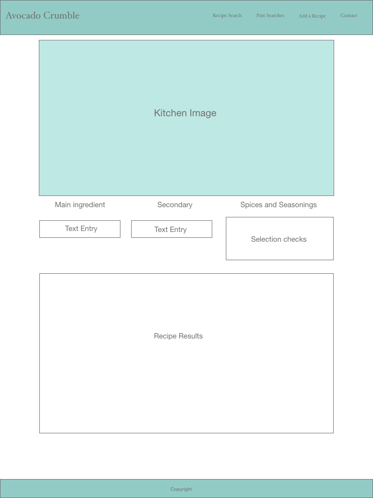
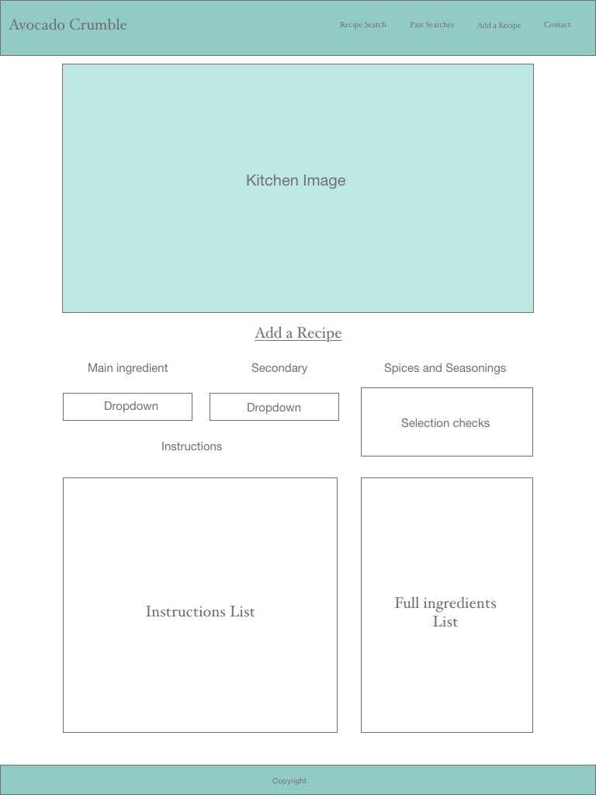

# Project Avocado Crumble

## Goal
The goal of the project is to provide a resource where people can enter ingredients they have on hand in thier regrigerator or pantry and be shown a list of possible recipes they can make with what they have entered.

## MVP
* Entering ingredients the user has on hand under pre-selected categories such as main, add ons, and seasonings, would show the user a list of potential recipes they could make with what they have on hand.
* Past user searches would be displayed and viewable on the page and stored in the database to persist over page refresh.
* Users would be able to add their own recipes to the site which would also be included in the search.

## Technologies used
* Node and Express web server.
* mySQL database using sequelize to connect from our server.
* **new library, package, or technology** Chosen?
* Yummly APIs
  * Recipe search
    * Diet restrictions
    * Allergy restrictions
* Handlebars for rendering the site
* Heroku for site deployment.

## Mock ups
  

## Future dev
* User accounts
 * Allow users to log in and save favorite recipes
 * Allow users to manage submitted recipes
* Recipe reviews

#### For help and support
Contact Bob Syd or Amy

Project created and maintained by Amy Bob and Syd
